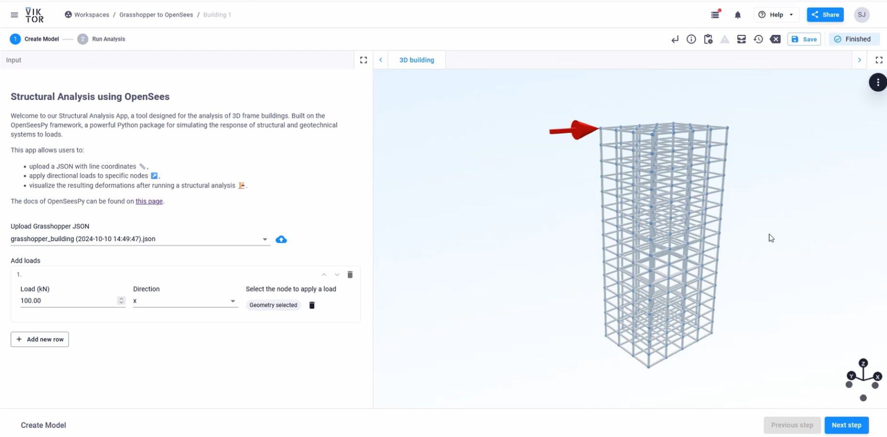

# Grasshopper to OpenSees
This template app demonstrates how to perform a structural analysis of a 3D frame building which is created using Grasshopper 
and display the results using VIKTOR. The structural analysis is conducted with OpenSees, a powerful and widely-used software for analyzing the 
structural response of structural and geotechnical systems to loads. 

Features include:
- Import and visualization of the 3D geometry from Grasshopper 
- Definition of loads 
- Running the structural analysis 
- Visualization of the deformed building

Here you can see a video of the complete flow: [Push Geometry from VIKTOR to Grasshopper](https://player.vimeo.com/video/1019705380)

**Important** OpenSeesPy is free for research, education, and internal use. Commercial redistribution of OpenSeesPy, 
such as, but not limited to, an application or cloud-based service that uses import openseespy, requires a license 
similar to that required for commercial redistribution of OpenSees.exe. Contact 
[UC Berkeley](https://opensees.github.io/OpenSeesDocumentation/developer/license.html) for commercial licensing 
details.

### Step 1a: Push the geometry from Grasshopper to VIKTOR
The geometry from Grasshopper is pushed to the VIKTOR app via the API. The Grasshopper file can be found here: 
[grasshopper_viktor_push_geometry.gh](grasshopper-files/grasshopper_viktor_push_geometry.gh). 

### Step 1b: Apply loads
For each load, a magnitude, direction and location can be defined.
- The magnitude is defined in kN.
- The direction can be defined in x, y and z-direction.
- The location can be selected with 'Select Geometry' and clicking on any node in the view on the right side.

Extra loads can be added by clicking on 'Add new row'. The load is visualized in the view on the right side with a red 
arrow.

### Step 2: Running the analysis and viewing the results
After clicking on 'Next Step', the analysis can be performed by clicking on the 'Run analysis' button in the bottom 
right. Once the analysis is complete, both the undeformed and deformed building can be viewed on the right side. With a
color scale, the amount of deformation per element is also mapped onto the building. The deformation can be scaled with 
the 'Deformation scale factor'. If this is altered, the analysis must be performed again by clicking on 'Run analysis'.

